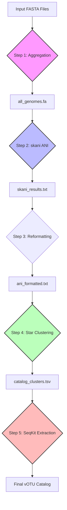

# Pipeline Methodology and Implementation

This document provides a comprehensive technical overview of the computational workflow, algorithms, and bioinformatic tools integrated into the `viral-cataloger` pipeline.

---

## 📊 Workflow Overview

The pipeline follows a structured five-step process to transform a raw collection of viral assemblies into a refined, non-redundant genomic catalog.

---

## 🔄 Ecosystem Integration

This tool operates as the "Librarian" in a larger viral discovery workflow, designed to ingest output from the **Viral Discovery Pipeline (Viro-Flow)** (the "Miner").

### The "Miner" vs. "Librarian" Model
*   **Viro-Flow (Miner)**: Extracts potential viral signals from raw metagenomic data. It prioritizes sensitivity but often produces redundant or fragmented assemblies across different samples.
*   **Genome Cataloger (Librarian)**: Takes these fragmented discoveries and organizes them into a stable, non-redundant reference catalog using strict quality thresholds.

### Abundance Normalization (TPM)
While this cataloger focuses on dereplication, the ultimate goal of the ecosystem is accurate abundance profiling. By creating a non-redundant vOTU catalog, we ensure that:
1.  **Read Mapping is Specific**: Reads map to a single representative rather than being split arbitrarily among identical duplicates.
2.  **TPM Calculation is Accurate**: The upstream Viro-Flow pipeline uses **Transcripts Per Million (TPM)** to normalize abundance. This metric allows for valid cross-sample comparisons (e.g., "Virus A is more abundant in Sample 1 than Sample 2") which is only mathematically sound when the reference database is free of redundancy.

---

## 🧬 Step 1: Genome Aggregation
*   **Implementation**: Native Python `pathlib` and file I/O.
*   **Process**: The pipeline scans the input directory for files with `.fa`, `.fna`, or `.fasta` extensions. These individual files are concatenated into a single master FASTA file (`all_genomes.fa`).
*   **Rationale**: Performance-optimized ANI tools like `skani` are most efficient when performing "all-vs-all" comparisons on a single multi-sequence file rather than thousands of individual files.

---

## 🔬 Step 2: High-Resolution ANI Calculation
*   **Tool**: **skani** (v0.2+)
*   **Purpose**: To estimate the Average Nucleotide Identity (ANI) and alignment fraction (AF) between all pairs of genomes.
*   **Key Parameters**:
    *   `-i`: Treats each record in the multi-FASTA file as an independent genome.
    *   `-m 200`: Adjusts k-mer sketch density for small viral genomes (~10kb - 200kb).
    *   `--slow`: Uses alignment-based AF calculation for maximum precision in species demarcation.
    *   `-s 90`: Pre-screens pairs at 90% identity to skip distant relatives, dramatically reducing computation time.
*   **Scientific Rationale**: `skani` provides accuracy comparable to BLAST-based ANI but at orders of magnitude higher speed, making it feasible to catalog tens of thousands of viral genomes on standard hardware.

---

## ✍️ Step 3: Native Data Reformatting
*   **Implementation**: Native Python `csv` parsing.
*   **Change Log**: Previously implemented via `awk`, now handled natively for cross-platform stability.
*   **Process**: Translates `skani` output (fractions 0.0-1.0) into percentages (0-100%) and filters malformed records. It prepares a standardized edge-list for the clustering algorithm.

---

## 🧩 Step 4: Greedy Star-Topology Clustering
*   **Algorithm**: Greedy Representative (Star Topology).
*   **Process**:
    1.  **Length Sorting**: All sequences are ranked by length. The longest sequence is assumed to be the most "complete" representative.
    2.  **Representative Selection**: The longest unassigned sequence is designated as the "Seed" for a new cluster.
    3.  **Direct Assignment**: The algorithm scans for all other unassigned sequences that meet the user-defined thresholds (e.g., ≥95% ANI and ≥85% Coverage) **specifically against that Seed**.
    4.  **Exclusion**: Once assigned to a Seed, a sequence cannot be recruited by any other cluster.
*   **Why Star Topology?**: Traditional "transitive" clustering (A matches B, B matches C, therefore A=C) can lead to "chaining," where biological species boundaries are blurred. Star topology ensures every member is directly similar to the cluster's high-quality representative.

---

## ✅ Step 5: Final Catalog Extraction
*   **Tool**: **SeqKit**
*   **Process**: Uses `seqkit grep` to efficiently extract the full nucleotide sequences for only the designated cluster representatives.
*   **Final Output**: A non-redundant FASTA file representing the "pangenome" or "catalog" of the viral community.

---

## 🛠 Tool Specifications

| Tool | Version (Tested) | Role |
| :--- | :--- | :--- |
| **Python** | 3.9 - 3.12 | Orchestration & Clustering logic |
| **skani** | 0.2.1 | Fast ANI estimation |
| **SeqKit** | 2.8.0 | Sequence manipulation |

---

## 📚 Technical References

1.  **skani**: Ondov, B.D., et al. (2023). "Fast and accurate average nucleotide identity estimation with skani." *Nature Biotechnology*.
2.  **SeqKit**: Shen, W., et al. (2016). "SeqKit: A Cross-Platform and Ultrafast Toolkit for FASTA/Q File Manipulation." *PLoS ONE*.
3.  **Clustering Standards**: Roux, S., et al. (2019). "Minimum Information about an Uncultivated Virus Genome (MIUViG)." *Nature Biotechnology*.
